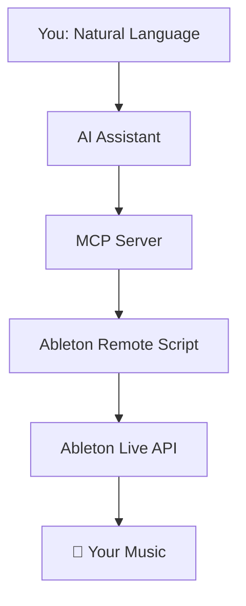

# Studioworks Core
**Control Ableton Live using natural language via AI assistants like Claude, Cursor, or any MCP-compatible tool. Studioworks Core provides a robust Model Context Protocol (MCP) server that translates natural language commands into precise actions within your Ableton Live session.**

[](https://opensource.org/licenses/MIT)
[](https://www.python.org/downloads/)
[](https://www.ableton.com/)

This project builds on the [ableton-mcp-extended](https://github.com/uisato/ableton-mcp-extended) project by uisato, with extended skills from [glincker/ableton-skills](https://github.com/glincker/ableton-skills).

A number of issues have been resolved including optimizing the context to reduce token consultions and adding in audio file handling and fixing a range of issues to make the skills stable and complete.

---

The tools are designed for musicians, producers, developers, and music enthusiasts who want to streamline their music production workflow, experiment with generative music, and use custom integrations with Ableton Live (and other DAW software in the future).

---

## Key Features

This project provides comprehensive, programmatic control over the Ableton Live environment.

* **Session and Transport Control:**
    * Start and stop playback, set tempo.
    * Get session info, including tempo, time signature, and track count.
    * Fire individual clips or an entire scene at once (all tracks in that row, simultaneously).
    * Create, jump to, and delete cue points for quick navigation.

* **Track Management:**
    * Create, rename, and get detailed information for MIDI and audio tracks.
    * Control track properties: volume and panning.
    * Manage track grouping and folding states.

* **MIDI Clip and Note Manipulation:**
    * Create, delete, and name MIDI clips with specified lengths.
    * Add, delete, and replace notes within clips (Session View and Arrangement View).
    * Perform batch edits on multiple notes in a single operation.

* **Arrangement View:**
    * Full timeline control — create, edit, and audition arrangement clips.
    * Promote Session View loops into a structured arrangement.
    * Loop, tempo, and playback control across the full timeline.

* **Device and Parameter Control:**
    * Load instruments and effects from Ableton's browser by URI.
    * Get a full list of parameters for any device on a track.
    * Set and batch-set device parameters using normalized values (0.0 to 1.0).

* **Automation and Envelopes:**
    * Add and clear automation points for any device parameter within a Session View clip.
    * Get information about existing clip envelopes.
    * (Note: automation envelopes are a Session View-only concept in the Ableton API — Arrangement clip automation must be drawn manually.)

* **Browser Integration:**
    * Navigate and list items from Ableton's browser.
    * Load instruments, effects, and samples directly from a browser path or URI.
    * Import audio files directly into audio tracks, Arrangement clips, or Session View clip slots.

* **Grid Automation (proof-of-concept)**
    * Load audio files straight into Session View slots (`create_session_audio_clip`) and remove them safely (`delete_session_clip`, with a built-in guard against orphaning content from Follow Actions).
    * A standalone batch script (`scripts/populate_grid.py`) sources drum/breakbeat loops from your Ableton libraries, slices them into one-bar chops, and populates a grid with density-weighted, gap-free placement.
    * The `grid-conductor` skill layers conversational control on top of native Ableton Follow Actions — ask for a build, a drop, a breakdown, or a content refresh, entirely in natural language.

* **AI Production Skills**
    * 13 built-in skills as slash commands: groove-builder, chord-pro, tempo-coach,
      arrangement-coach, genre-edm-production, automation-coach, grid-conductor, and more
    * Invoke with /groove-builder, /chord-pro, /arrangement-coach, /grid-conductor etc. in Claude Code
    * Skills encode genre-specific patterns, MIDI maps, mix balance defaults

---

##  Quick Start (5 Minutes)

### Prerequisites
- Ableton Live 11+ (any edition)
- Python 3.10 or higher
- Claude Desktop or Visual Studio IDE

### 1. **Get the Code**
```bash
git clone https://github.com/mumumedia/studioworks-core.git
cd studioworks-core
python3 -m venv .venv
source .venv/bin/activate          # Windows: .venv\Scripts\activate
pip install -e .
```

### 2. **Install Ableton Script**
1. Find your Ableton User Library Remote Scripts folder:
   - **Windows**: `C:\Users\[You]\Documents\Ableton\User Library\Remote Scripts\`
   - **Mac**: `~/Music/Ableton/User Library/Remote Scripts/`
2. Create folder: `AbletonMCP`
3. Copy `AbletonMCP_Remote_Script/__init__.py` into this folder

### 3. **Configure Ableton**
1. Open Ableton Live
2. Go to **Preferences** → **Link, Tempo & MIDI**
3. Set **Control Surface** to "AbletonMCP"
4. Set Input/Output to "None"

### 4. **Connect AI Assistant**

**For Claude Desktop:**

🍎 macOS:
```json
{
  "mcpServers": {
    "AbletonMCP": {
      "command": "python3",
      "args": ["/path/to/studioworks-core/MCP_Server/server.py"]
    }
  }
}
```
> If using a virtual environment: replace `python3` with `/path/to/studioworks-core/.venv/bin/python`

🪟 Windows:
```json
{
  "mcpServers": {
    "AbletonMCP": {
      "command": "python",
      "args": ["C:\\path\\to\\studioworks-core\\MCP_Server\\server.py"]
    }
  }
}
```

**For Cursor:**
Add MCP server in Settings → MCP with the same path.

### 5. **Start Creating!** 
Open your AI assistant and try:
- *"Create a new MIDI track with a piano"*
- *"Add a simple drum beat"*
- *"What tracks do I currently have?"*

---

## How It Works



1. You issue a command in plain English to your Studioworks assistant (e.g., "Create a new MIDI track and name it 'Bass'").
2. The Studioworks Assistant understands the intent and calls the appropriate tool from the MCP server.
3. The MCP Server (server.py) receives the tool call and constructs a specific JSON command.
4. The Ableton Remote Script (__init__.py), running inside Live, receives the JSON command via a socket connection.
5. The Remote Script executes the command using the official Ableton Live API, making the change in your session instantly.

---

## Advanced Features

<details>
<summary><strong>🚀 High-Performance Mode (UDP Server)</strong></summary>


For real-time parameter control with ultra-low latency:

```bash
# Install the hybrid server
cp -r Ableton-MCP_hybrid-server/AbletonMCP_UDP/ ~/Remote\ Scripts/AbletonMCP_UDP/
```

</details>

---

## Components Overview

This project includes several specialized components:

### **Core MCP Server**
- Standard TCP communication for reliable AI control
- Extensive Ableton Live API integration
- Compatible with Claude Desktop, Cursor, and Gemini CLI.

### **Hybrid TCP/UDP Server** 
- High-performance real-time parameter control
- Ultra-low latency for live performance
- Perfect for controllers and interactive tools

---

## Documentation

- **[Installation Guide](INSTALLATION.md)** - Detailed setup instructions
- **[User Guide](README.md)** - What, which, and how  

---

## Community & Support

- **GitHub Issues**: Bug reports and feature requests
- **Discussions**: Share your creations and get help

---

## What's Next

- ~**VST Plugin Support** - Control third-party plugins~ → Done!
- ~**Automation Point Placement**~ → Done!
- ~**Arrangement View** - Full timeline control~ → Done!
- ~**Optimize Token Usage** - Reduce the number of tokens needed for each completion~ → Done!
- ~**Grid Automation** - AI-driven generative Session View population + conversational playback control~ → Done!
- **Hardware Integration** - Bridge MIDI controllers through AI
- **Advanced AI** - Smarter and better music understanding and generation

---

## License & Credits

This project is licensed under the MIT License - see [LICENSE](LICENSE) for details.

**Built with:**
- [Model Context Protocol](https://github.com/modelcontextprotocol) - AI integration framework
- [Ableton Live](https://www.ableton.com) - Digital audio workstation

**Inspired by:** The original [ableton-mcp](https://github.com/ahujasid/ableton-mcp) project

---

<div align="center">

**Made with ❤️ for the music production community**

*If this project helps your creativity, consider giving it a ⭐ star!*

</div> 
